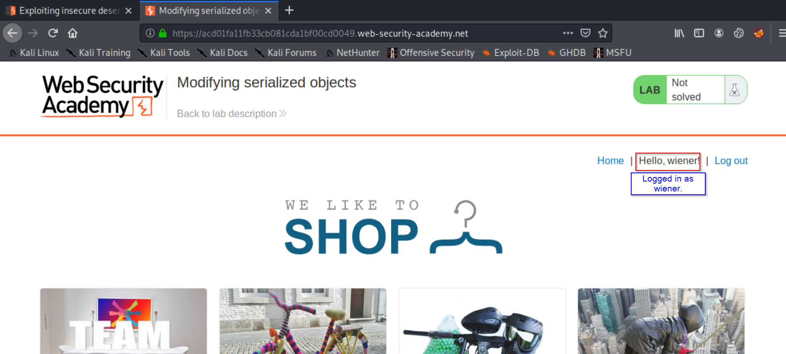

# Lab 1
## Modifying Serialized Objects

### Question Description:
We have user access as `wiener:peter` but the lab is vulnerable to insecure deserialization which helps us to escalate privilege as admin. After gaining admin access we just have to delete Carlos's(other user) account.

### Tools needed:

- Burp Suite ( If you have not setup burp suite yet [refer this](https://www.youtube.com/watch?v=YCCrVtvAu2I). )

#### Step 1 [ Login ]:

Login with the given credentials and you will see below screen.

#### Step 2 [ Intercept HTTP request on burp suite ]:

Start burp suite you have setup and refresh the home page after logging in on the lab. It will directly be intercepted by burp suite like below.

#### Step 3 [ Burp repeater and finding the serialized object ]:

Forward the HTTP request to burp repeater.

Generally serialized objects are always in cookies section with 1) base64 encoded and then 2) URL encoded text which will look like below.

Decode above object and it will look like below.
> O:4:"User":2:{s:8:"username";s:6:"wiener";s:5:"admin";b:0;}

#### Step 4 [ Modifying the object ]:

Here our point of interest is admin part, where we see b:0. We can change it to b:1 as 1 is equivalent to `True` and the modified object will look like below.
> O:4:"User":2:{s:8:"username";s:6:"wiener";s:5:"admin";b:1;}

Encode it with base64 and then URL encode it which will look like below.
> Tzo0OiJVc2VyIjoyOntzOjg6InVzZXJuYW1lIjtzOjY6IndpZW5lciI7czo1OiJhZG1pbiI7YjoxO30%3d

#### Step 5 [Forward the Request ]:

Forward the http request with above encoded text in session on proxy tab and you will be admin now just delete the account of Carlos and your lab is done.
