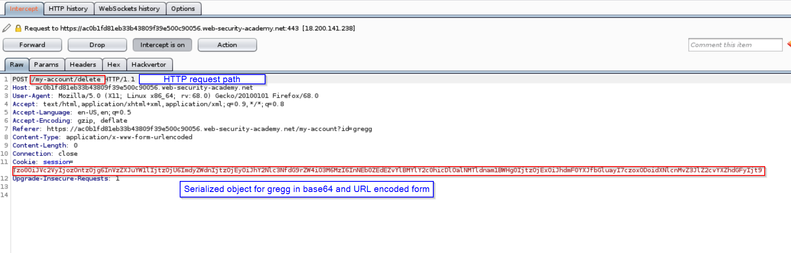

# Lab 3

## Using application functionality to exploit insecure deserialization

### Question Description:

We have user access as `wiener:peter` but the lab is vulnerable to unchecked deserialization and also the application in lab has delete user functionality. We have to somehow leverage delete user functionality to delete morale.txt ( File location `/home/carlos/morale.txt` ). As a backup user we have other user credential given as `gregg:rosebud`.

### Tools Used:

- Burp Suite

#### Step 1 [ Find what the HTTP request looks like for deleting an user ]

First of all let's find out where delete account facility actually sends HTTP request.

Login as `gregg` and then in `My account` tab intercept the request when you click on delete button which will look something like below.

Now we know the request path let's forward/drop above request and go ahead and login to wiener and change serialized object to delete `morale.txt`

#### Step 2 [ Intercept and decode phase ]:

After logging in as wiener intercept the home page and send it to burp repeater ( Check lab 1 if you don't know how to do it. ) and notice the cookie section. Generally our object is encoded with base64 and then encoded with URL encoding which in our case looks like below.

> Tzo0OiJVc2VyIjozOntzOjg6InVzZXJuYW1lIjtzOjY6IndpZW5lciI7czoxMjoiYWNjZXNzX3Rva2VuIjtzOjMyOiJsM1dYeWRvdDU1NHlHRWl2TmxTdFpQNURvdzhUd3VjUyI7czoxMToiYXZhdGFyX2xpbmsiO3M6MTk6InVzZXJzL3dpZW5lci9hdmF0YXIiO30%3d

Decoded object will look like below.

> O:4:"User":3:{s:8:"username";s:6:"wiener";s:12:"access_token";s:32:"l3WXydot554yGEivNlStZP5Dow8TwucS";s:11:"avatar_link";s:19:"users/wiener/avatar";}

#### Step 3 [ Modify object, encode and forward the delete use request ]:

After decoding above object notice the attribute `avatar_link` which has value `users/wiener/avatar`. The file here also gets deleted when we delete the account which is essentially the functionality of the application. so if we change the the location to `/home/carlos/morale.txt` and then send this serialized object to `/my-account/delete` and if it passes unchecked it will delete above file with the user and this is what we want!

Modified serialized object:

> O:4:"User":3:{s:8:"username";s:6:"wiener";s:12:"access_token";s:32:"l3WXydot554yGEivNlStZP5Dow8TwucS";s:11:"avatar_link";s:23:"/home/carlos/morale.txt";}

Which will be encoded to :

> Tzo0OiJVc2VyIjozOntzOjg6InVzZXJuYW1lIjtzOjY6IndpZW5lciI7czoxMjoiYWNjZXNzX3Rva2VuIjtzOjMyOiJsM1dYeWRvdDU1NHlHRWl2TmxTdFpQNURvdzhUd3VjUyI7czoxMToiYXZhdGFyX2xpbmsiO3M6MjM6Ii9ob21lL2Nhcmxvcy9tb3JhbGUudHh0Ijt9

Forward the request to `/my-account/delete` with above object in cookie section will delete the `morale.txt` file and your lab is completed.
